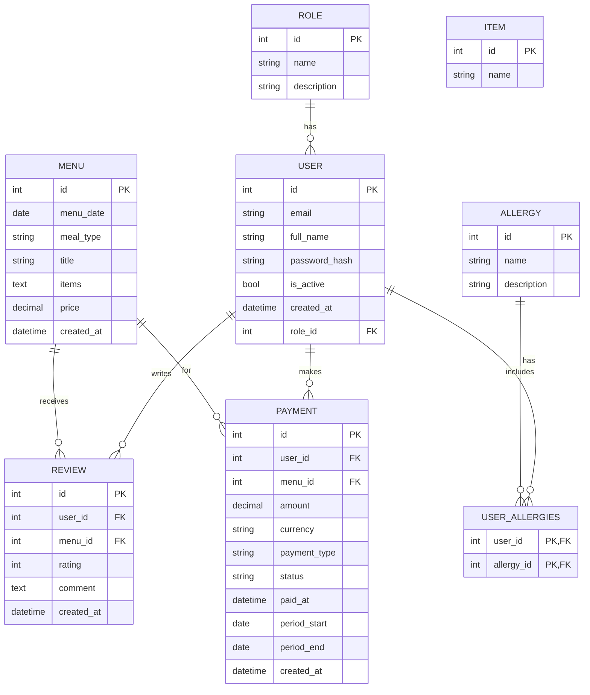

```mermaid
erDiagram
  ROLE ||--o{ USER : has
  USER ||--o{ REVIEW : writes
  MENU ||--o{ REVIEW : receives
  USER ||--o{ PAYMENT : makes
  MENU ||--o{ PAYMENT : for
  USER ||--o{ USER_ALLERGIES : has
  ALLERGY ||--o{ USER_ALLERGIES : includes

  ROLE {
    int id PK
    string name
    string description
  }

  USER {
    int id PK
    string email
    string full_name
    string password_hash
    bool is_active
    datetime created_at
    int role_id FK
  }

  ALLERGY {
    int id PK
    string name
    string description
  }

  USER_ALLERGIES {
    int user_id PK, FK
    int allergy_id PK, FK
  }

  MENU {
    int id PK
    date menu_date
    string meal_type
    string title
    text items
    decimal price
    datetime created_at
  }

  REVIEW {
    int id PK
    int user_id FK
    int menu_id FK
    int rating
    text comment
    datetime created_at
  }

  PAYMENT {
    int id PK
    int user_id FK
    int menu_id FK
    decimal amount
    string currency
    string payment_type
    string status
    datetime paid_at
    date period_start
    date period_end
    datetime created_at
  }

  ITEM {
    int id PK
    string name
  }
```
